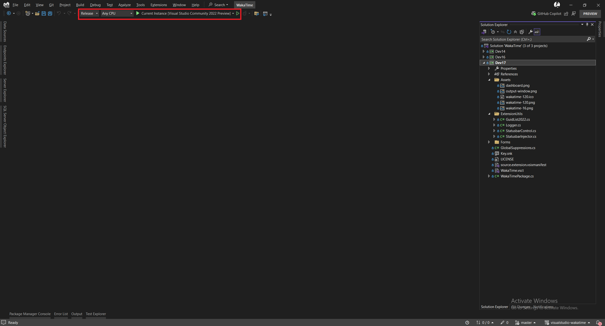
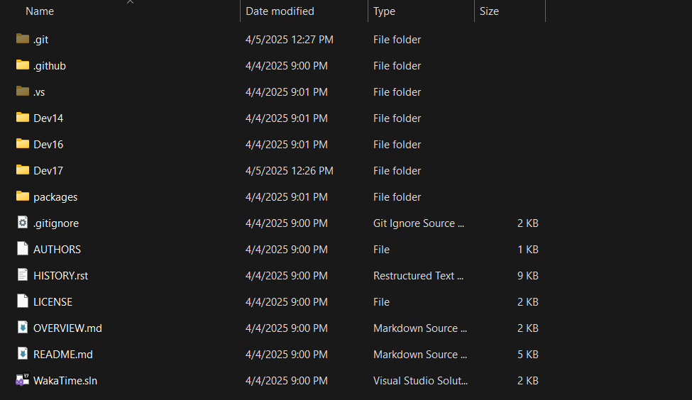

# Installing WakaTime for Visual Studio: Step-by-Step Guide

### Step 1: Clone the WakaTime Project

- Clone the WakaTime repository from GitHub `git clone https://github.com/pphatt/visualstudio-wakatime.git`
- Open the project in Visual Studio.

### Step 2: Configure and Build WakaTime

**1. Customize the Source Code (Optional):**
* If you need to modify the extension, edit the source code in the latest version directory (e.g., `Dev17` for Visual Studio 2022).
* Focus changes on files relevant to your needs (e.g., feature additions or bug fixes).

**2. Build the Project:**

* In Visual Studio, set the solution configuration to Release (not Debug).
* Build the solution:
  * Right-click the solution in Solution Explorer → select Build Solution, or use the shortcut `Ctrl+Shift+B`.
  * Ensure the build completes without errors.

**3. Locate the Built Extension:**

* Navigate to the project folder in File Explorer.
* Go to: `Dev17/bin/x64/Release`.
* Find the generated `WakaTime.Dev17.vsix` file.

<!--
Note:
1. There is a potential bug that happened, and here what is it and how to resolve it:

The bug is that when you install the extension locally for the first time, and then change something in the source code, and you install it again will be failed and go to the extension tab uninstall it will sometime work and sometime not work.

2. If it not work, here is the solution:

Install the original version on the Visual Studio Extension Marketplace.
Reset Visual Studio, install it as it is.
Then uninstall it, uninstall it will remove any potential conflict with the local version.
And then install the local version.
This will reslove the problem.
-->

### Troubleshooting:
**Potential Issue: Extension Installation Conflicts**

* **Problem:** After installing the extension locally, changing the source code, and reinstalling, the updated version may fail to install. Uninstalling via Visual Studio’s Extensions tab (`Extensions > Manage Extensions`) may also be inconsistent (sometime will fix, sometime don't).
* **Cause:** Conflicts between the local version and cached extension data in Visual Studio.

**2. If it not work, here is the solution:**
- Install the original version on the Visual Studio Extension Marketplace.
- Reset Visual Studio, install it as it is.
- Then uninstall it, uninstall it will remove any potential conflict with the local version.
- And then install the local version.
- This will reslove the problem.

# Reference:

- [How to make and install extension locally on Visual Studio](https://grok.com/share/bGVnYWN5_1e5e47ce-69f8-4690-9d78-b8b4f4392724)
